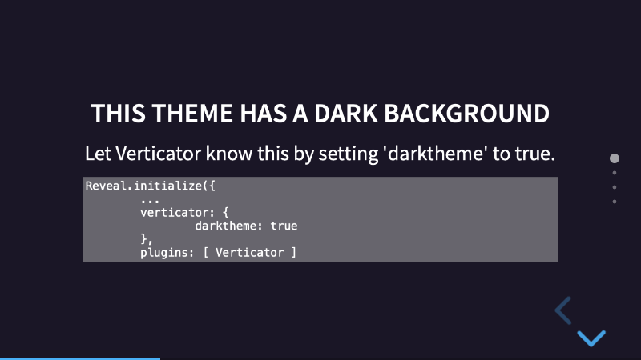

# Verticator

A plugin for [Reveal.js](https://revealjs.com) 4 that adds indicators to show the amount of slides in a vertical stack. 

[](https://martinomagnifico.github.io/reveal.js-verticator/demo.html)

Sometimes you would like to have an indication of how many slides are remaining in a vertical stack. This plugin does just that. It is visually similar to the indicators at [fullPage.js](https://alvarotrigo.com/fullPage/). 

* [Demo (no options set)](https://martinomagnifico.github.io/reveal.js-verticator/demo.html)
* [Dark theme with no color options](https://martinomagnifico.github.io/reveal.js-verticator/demodark.html)
* [Light theme with color options](https://martinomagnifico.github.io/reveal.js-verticator/democolor.html)
* [Dark theme with color options](https://martinomagnifico.github.io/reveal.js-verticator/demodarkcolor.html)


Don't overdo it. You probably don’t want 30 bullets on the right-hand side of your presentation.


## Installation

Copy the verticator folder to the plugins folder of the reveal.js folder, like this: `plugin/verticator`. Now add it to the dependencies of Reveal.js:

### JavaScript

The Verticator plugin has been rewritten for Reveal.js version 4.

If you want to use Verticator with an older version of Reveal, use the [1.0.2 version](https://github.com/Martinomagnifico/reveal.js-verticator/releases).

There are two JavaScript files for Verticator, a regular one, `verticator.js`, and a module one, `verticator.esm.js`. You only need one of them:

#### Regular 
If you're not using ES modules, for example, to be able to run your presentation from the filesystem, you can add it like this:

```html
<script type="text/javascript" src="dist/reveal.js"></script>
<script src="plugin/verticator/verticator.js"></script>
<script>
	Reveal.initialize({
		// ...
		plugins: [ Verticator ]
	});
</script>
```
#### As a module 
If you're using ES modules, you can add it like this:

```html
<script type="module">
	// This will need a server
	import Reveal from './dist/reveal.esm.js';
	import Verticator from './plugin/verticator/verticator.esm.js';
	Reveal.initialize({
		// ...
		plugins: [ Verticator ]
	});
</script>
```


## Configuration

There are a few options that you can change from the Reveal.js options. The values below are default and do not need to be set if not changed.

```javascript
Reveal.initialize({
	// ...
	verticator: {
		darktheme: false,
		color: '',
		oppositecolor: '',
		skipuncounted: false,
		clickable: true
	},
	plugins: [ Verticator ]
	// ... 
	]
});
```

* **`darktheme`**: Verticator assumes a light theme by default. Let Verticator know if your theme is dark with this option.
    * By default, the Verticator bullets are black, and will be white on a dark slide. By setting  `darktheme: true`, this behaviour is inverted.
    * Reveal.js offers an option to let certain slides have an other background than the rest. For example, if the theme is light, and you use `<section(data-background-color="#000")></section>` on one or more slides, those slides will then be black. For dark themes, you simply use a light color in the data-attribute. The value of the data-attribute needs to be hexadecimal, because Reveal.js does a calculation on it to see if that color is light or dark. The Verticator bullets will invert on those slides.
    * Some of the themes ('simple', 'black' and 'white') will also invert the text colors in that case. If you use another theme, you need to copy that CSS to your own theme. The Verticator inverting behaviour will always work, even if the theme text colors are not inverted.
* **`color`**: To override the default black color (or the white color if darktheme is true), simply give a new color here. You can use standard CSS -, hexadecimal - or rgb colors.
* **`oppositecolor`**: To override the default white color (or the black color if darktheme is true) on slides that have a dark color (or light color if darktheme is true) set through the data-attribute, simply give a new color here. You can use standard CSS -, hexadecimal - or rgb colors.
* **`skipuncounted`**: Slides that are marked with Reveal.js 4.0' data-visibility="uncounted"-property can be skipped.
* **`clickable`**: Clicking on a a Verticator bullet jumps to to the corresponding page. This behaviour is enabled by default but can be disabled.


## Like it?

If you like it, please star this repo.


## License
MIT licensed

Copyright (C) 2019 Martijn De Jongh (Martino)
